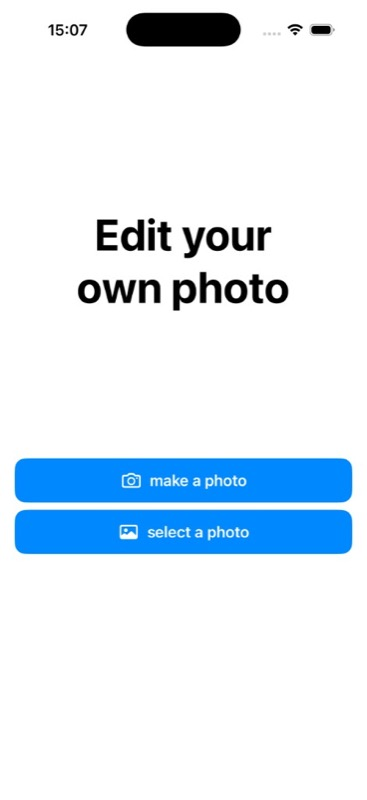
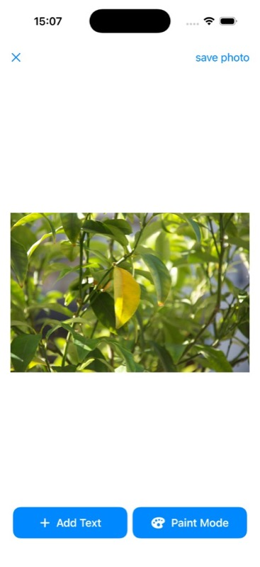
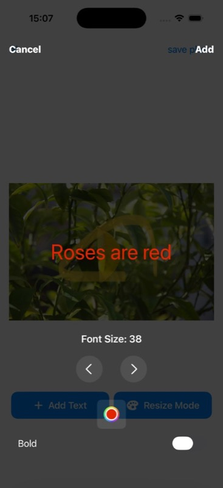
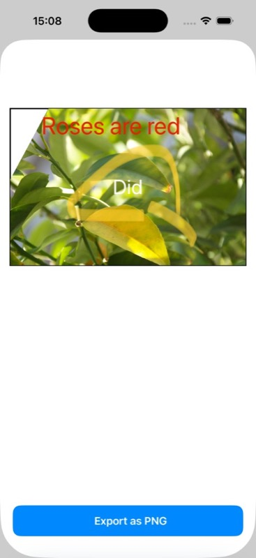
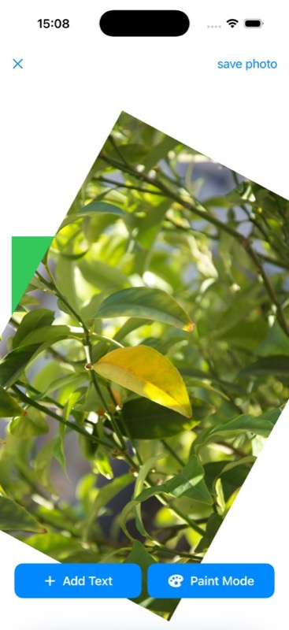

# iOSPhotoEditor

A simple SwiftUI photo editor pet project for iOS.  
The app lets you pick or take a photo, draw on top of it, add styled text, rotate/resize content, and export the final result as an image.

## Features

- Capture a photo with camera or select one from gallery
- Draw with multiple brush styles and colors
- Add text with configurable size, color, and bold option
- Switch between paint mode and resize/transform mode
- Export edited composition as PNG

## Screenshots

  
  
  

  
  

